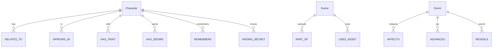

# Neo4j World Graph

A persistent graph database for narrative world simulation. Characters have relationships with numerical drama state -- trust, resentment, attraction, tension, fear of loss, power imbalance -- that changes when events happen.

## License

[MIT](LICENSE)

## The Idea

Most story engines track "who knows whom." This tracks *how they feel about each other*, numerically, and updates those feelings when things happen.

A betrayal doesn't just create a plot point. It applies `trust: -0.30, resentment: +0.40, tension: +0.15` to the relationship edge. A near-kiss applies `attraction: +0.15, tension: +0.25`. The numbers persist across scenes and episodes, so the AI (or a human writer) can query the current emotional state of any relationship and write accordingly.

The graph also tracks secrets, desires, memories, arcs, and reputation -- all as nodes with structured relationships to characters and events.

## Schema



### Relationship Edge Fields

| Field | Range | Description |
|-------|-------|-------------|
| `attraction` | 0.0 - 1.0 | Romantic/physical pull |
| `trust` | 0.0 - 1.0 | Reliability and honesty |
| `resentment` | 0.0 - 1.0 | Grudge accumulation |
| `dependency` | 0.0 - 1.0 | Need for the other character |
| `tension` | 0.0 - 1.0 | Unresolved friction |
| `fear_of_loss` | 0.0 - 1.0 | Attachment anxiety |
| `power_imbalance` | -1.0 - 1.0 | Dominance (negative = one-sided) |

### Event Types

Events are the *consequence layer*. Each event type applies known deltas to relationship edges:

| Event | trust | resentment | tension | attraction |
|-------|-------|------------|---------|------------|
| `BETRAYAL` | -0.30 | +0.40 | +0.15 | varies |
| `NEAR_KISS` | +/-0.05 | -- | +0.25 | +0.15 |
| `PUBLIC_HUMILIATION` | -0.35 | +0.45 | +0.10 | -- |
| `RECONCILIATION` | +0.15 | -0.15 | stays high | -- |
| `SECRET_REVEALED` | varies | +0.20 | +0.20 | -- |

Full taxonomy in [`docs/event_taxonomy.md`](docs/event_taxonomy.md).

## Narrative Governors

The world sim enforces continuity rules to prevent chaos:

- **Scandal cooldowns** -- major reveals need downtime before the next one
- **Escalation budget** -- every arc has limited escalation per episode
- **Emotional rhythm** -- contrast high-tension beats with humor, tenderness, or embarrassment
- **Arc spacing** -- don't resolve every active arc in the same episode
- **Consequence persistence** -- large events alter future prompts, wardrobe, posture, and relationships

Rules in [`docs/narrative_governors.md`](docs/narrative_governors.md).

## Quick Start

```bash
docker compose up -d

# Apply schema
cp schema/*.cypher import/
docker compose exec -T neo4j-world cypher-shell -u neo4j -p microdrama-local \
  -f /var/lib/neo4j/import/world_schema.cypher
docker compose exec -T neo4j-world cypher-shell -u neo4j -p microdrama-local \
  -f /var/lib/neo4j/import/seed_world.cypher
```

### Ingest a Story Event

```bash
python3 scripts/ingest_story_event.py \
  --event-json examples/events/private_warning_escalation.json
```

### Export Character Memory Context

```bash
python3 scripts/export_memory_context.py \
  --scene-manifest /path/to/scene_manifest.json \
  --output-md /tmp/memory_context.md \
  --output-json /tmp/memory_context.json
```

The Markdown export is designed for planner prompts. The JSON export is for automation.

## Who This Is For

- **Narrative AI researchers** building story generation systems that need persistent emotional state
- **Game developers** prototyping NPC relationship systems with structured drama
- **Interactive fiction** authors who want mechanical consequences for player choices
- **AI video pipelines** that need to track character continuity across generated scenes

## Full Documentation

- [`docs/relationship_update_rules.md`](docs/relationship_update_rules.md) -- edge field ranges, delta examples, governor rules
- [`docs/event_taxonomy.md`](docs/event_taxonomy.md) -- event types, required fields, quality rules
- [`docs/narrative_governors.md`](docs/narrative_governors.md) -- continuity enforcement, episode shape, anti-patterns
- [`docs/memory_compression.md`](docs/memory_compression.md) -- exporting compressed context for LLM prompts
